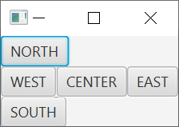
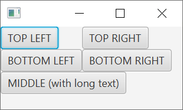

# 6.2. Layouts, building the UI

In the previous submodule, we learnt the basics of building a graphical user interface. In this submodule, we will learn how to build a more complex UI, using layouts.

In JavaFX, layouts are containers that can be used to group UI elements together. They are a way to organize the UI elements in a specific way. For example, we can use layouts to create a grid of buttons, or to stack buttons on top of each other.

In the examples of the previous submodule, we used one layout: the FlowPane. The FlowPane is a simple layout that stacks the UI elements horizontally or vertically. It is not very useful for building complex UIs, but it is a good layout to start with.

In this submodule, we will learn about more layouts used in JavaFX: the BorderPane, the GridPane, the HBox and the VBox. We will also learn how to use CSS to style our UI elements.

For each layout, a simple example with Button elements is shown. The examples are not very useful per se, but they are a good way to learn how the layouts work.

## 6.2.1. The BorderPane

The BorderPane is a layout that divides the window into five regions: top, bottom, left, right and center. Each region can contain only one UI element. The following image shows a BorderPane with a button in each region:



The following code shows how to create a BorderPane and add a button to each region:

```java
public class BorderPaneExample extends Application {

    @Override
    public void start(Stage window) {
        BorderPane layout = new BorderPane();

        Button topButton = new Button("NORTH");
        Button rightButton = new Button("EAST");
        Button bottomButton = new Button("SOUTH");
        Button leftButton = new Button("WEST");
        Button centerButton = new Button("CENTER");

        layout.setTop(topButton);
        layout.setRight(rightButton);
        layout.setBottom(bottomButton);
        layout.setLeft(leftButton);
        layout.setCenter(centerButton);

        Scene view = new Scene(layout);

        window.setScene(view);
        window.show();
    }

    public static void main(String[] args) {
        launch(BorderPaneExample.class);
    }

}
```

Note that the content located in the TOP and BOTTOM regions is not centered by default. If we would like to center the content in these regions, we can add the following lines to the code:

```java
layout.setAlignment(topButton, Pos.CENTER);
layout.setAlignment(bottomButton, Pos.CENTER);
```

In real applications, BorderPane provides a good layout for the main window of the application. The main menu of the application can be placed in the top region, and the main content of the application can be placed in the center region.

## 6.2.2. The GridPane

The GridPane is a layout that divides the window into a grid. The grid can have any number of rows and columns. Each cell of the grid can contain only one UI element. The following image shows a GridPane with a button in each cell:



The code that creates the GridPane and adds the buttons to it is shown below:

```java
public class LayoutDemo extends Application {

    @Override
    public void start(Stage stage) {
        GridPane layout = new GridPane();

        Button button1 = new Button("TOP LEFT");
        Button button2 = new Button("TOP RIGHT");
        Button button3 = new Button("BOTTOM LEFT");
        Button button4 = new Button("BOTTOM RIGHT");
        Button button5 = new Button("MIDDLE (with long text)");

        layout.add(button1, 0, 0);
        layout.add(button2, 1, 0);
        layout.add(button3, 0, 1);
        layout.add(button4, 1, 1);
        layout.add(button5, 0, 2, 2, 1);

        Scene view = new Scene(layout);

        stage.setScene(view);
        stage.show();
    }
}
```

The code adds the buttons to the GridPane by using the add method. The first parameter of the add method is the UI element to be added. The second and third parameters are the coordinates of the cell where the UI element is added. The coordinates start from the upper left corner of the grid, and the first column and row have index 0. The fourth and fifth parameters are the number of columns and rows that the UI element will span.

In the example, the last button is placed in the middle of the grid. It spans two columns and one row.

The GridPane is a good layout for building UIs that contain a grid of UI elements. An example of a natural layout for the GridPane is a chessboard, or the keyboard of a calculator.

## 6.2.3. The HBox and VBox

## 6.2.4. StackPane

## 6.2.5. AnchorPane

## 6.2.6. FlowPane and TilePane

In the earlier submodule, we used the FlowPane to stack UI elements horizontally or vertically. You probably remember that the FlowPane arranges the UI elements in the order they are added to the layout. If the UI elements do not fit in the window, the FlowPane wraps the UI elements to the next row or column.

The TilePane is quite similar to the FlowPane. The difference is that the TilePane arranges the UI elements in a grid. The UI elements are placed in the grid in the order they are added to the layout. If the UI elements do not fit in the window, the TilePane wraps the UI elements to the next row or column. The following image shows a TilePane with a button in each cell. In the image, you see how resizing the window affects the layout:


In the following code, we create an array of 12 buttons and add them to a TilePane:

```java
public class LayoutsDemo extends Application {

    @Override
    public void start(Stage stage) {
        TilePane layout = new TilePane();

        Button[] buttons = new Button[12];

        for (int i = 0; i < 12; i++) {
            buttons[i] = new Button("" + (i + 1));
            layout.getChildren().add(buttons[i]);
        }

        Scene view = new Scene(layout);

        stage.setScene(view);
        stage.show();
    }
}
```


## 6.2.6. Nesting containers

## 6.2.7. Styling the UI with CSS


