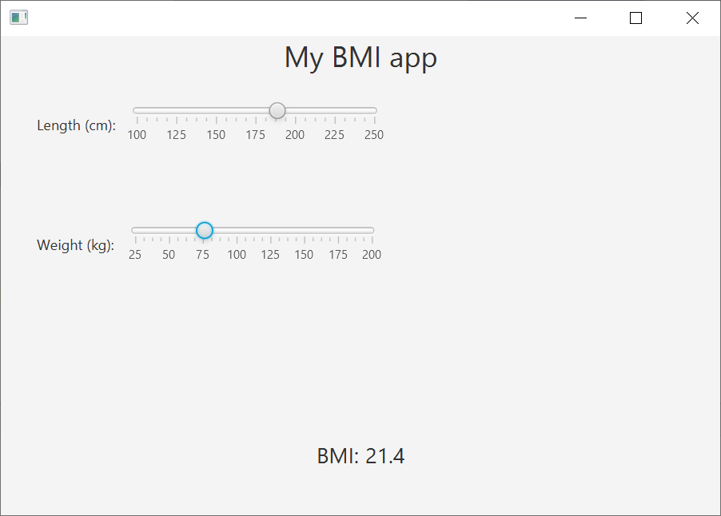
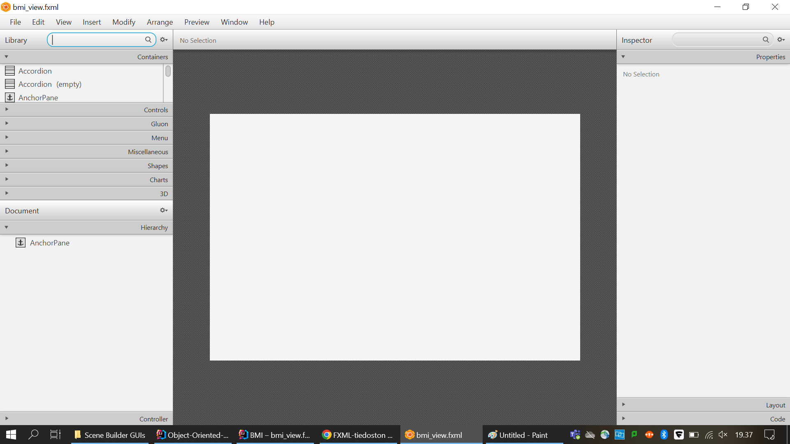

# 6.4. GUI design tools

In the previous submodules we have learn to build a graphical user interface from scratch. However, there are some tools that can help us to build a GUI in a faster way. In this submodule we will learn to use the Scene Builder tool to build a GUI.

Scene Builder is a visual layout tool that lets users quickly design JavaFX application user interfaces, without coding. Users can drag and drop UI components to a work area, modify their properties, apply style sheets, and the FXML code for the layout that they are creating is automatically generated in the background. The result is an FXML file that can then be combined with a Java project by binding the UI to the application’s logic.

## 6.4.1. Installing Scene Builder

Scene Builder is a standalone design tool that can be used with any Java IDE to create JavaFX UI designs. It is developed by Gluon and delivered as part of the OpenJFX distribution. It is free to download and use, and it is available for Windows, macOS, and Linux.

To install Scene Builder, follow these steps:

1. Download the latest version of Scene Builder from the [Scene Builder website](https://gluonhq.com/products/scene-builder/). If you are using Windows, download the Windows installer (.msi). If you are using macOS, download the macOS installer.
2. Run the installer and follow the instructions to install Scene Builder on your computer.

## 6.4.2. Building the first application with Scene Builder

Our goal is to build a simple BMI calculator with Scene Builder. The final result will be the following:

There are various ways in which you can utilize Scene Builder to create a JavaFX application. In this submodule we will use the following approach:

1. Create a new JavaFX project in IntelliJ IDEA.
2. Add an empty FXML file to the project.
2. Create the UI design in Scene Builder. The design will be saved in the FXML file.
3. Add the event handlers to the FXML file in IntelliJ IDEA.

This is the recommended approach for beginners that provides a good balance between the use of Scene Builder and IntelliJ IDEA.

First, generate a new JavaFX project in IntelliJ IDEA, and add the `model`, `view` and `controller` packages into the `src` folder. To do so, follow the steps described in the previous submodules.

Then, add a new FXML file to the src/resources folder of the
project. To do so, right-click on the `resources` folder and select `New` > `XML` > `XML File`. Name the file `bmi_view.fxml` and click `OK`. IntelliJ Idea creates a simple FXML file for a user interface that has an `AnchorPane` as the root element.

At this point, open Scene Builder and load the FXML file that you have just created. To do so, click `Open Project` and select the `bmi_view.fxml` file. The Scene Builder window will look like this:

On the Hierarchy card on the left, you see the structure of the user interface. It just displays one node, the AnchorPane, in the user interface.

