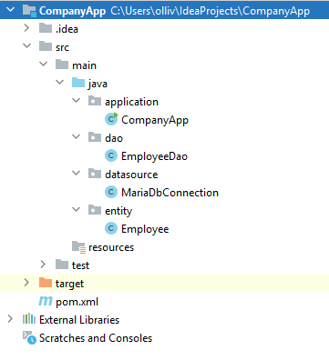

# 7.2 Database usage via JDBC driver

In this submodule, we learn to persist information
into the database and retrieve information from the database.

We use the Company database introduced in the previous submodule as an example. So far, the database contains
just one table, the EMPLOYEE table.

## 7.2.1. Designing the structure of the application

At this point, we design a structure for our application. We create a new Java project, and split the code into four
packages:
- application. This package contains the code for the main application.
- dao. This package contains the code for accessing the database.
- datasource. This package contains the code for connecting to the database.
- entity. This package contains the entity classes. Using MVC terms, this constitutes the model.

Image 
shows the structure of the project.

In each package, there can be one or more classes. In our example, there is just one class in each package.

## 7.2.2. The entity class

## 7.2.3. The datasource class

## 7.2.4. The DAO class

## 7.2.5. The application class

## 7.2.6. Retrieving information from the database

## 7.2.7. Persisting information in the database

## 7.2.8. Prepared statements

